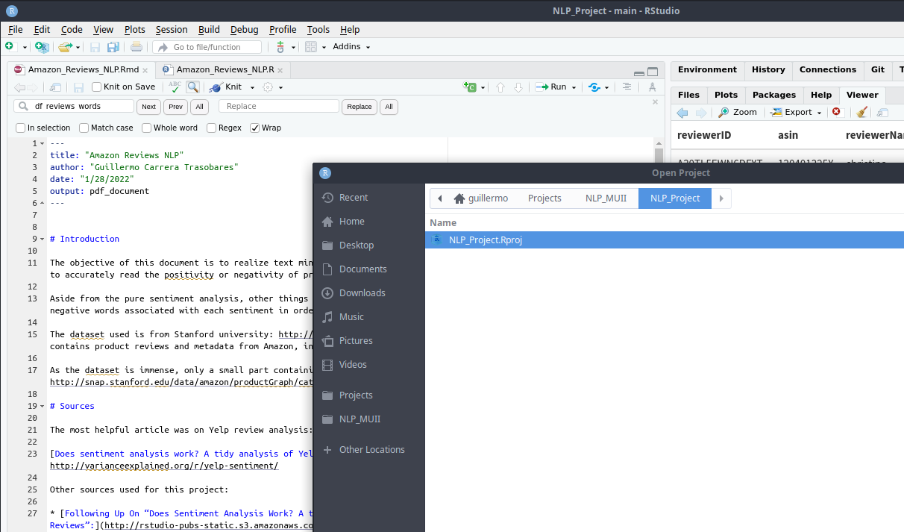
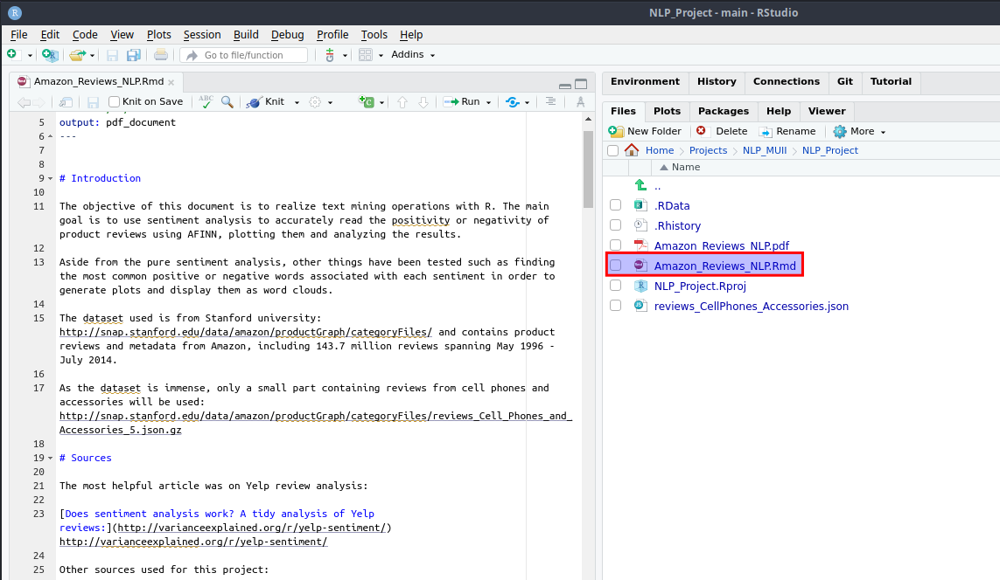
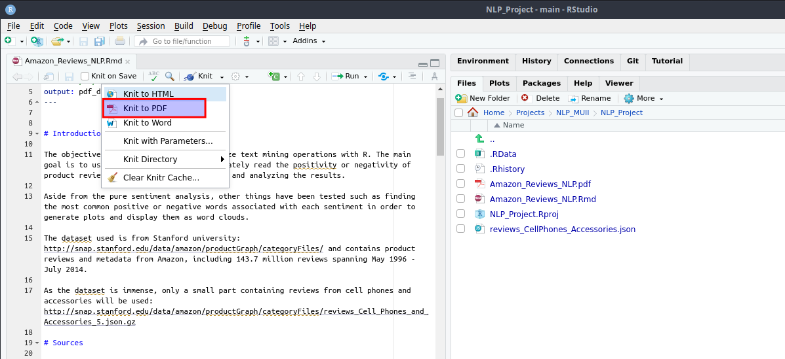
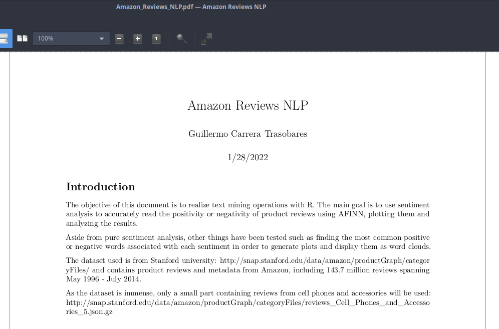

# NLP_MUII

Unit 5: Natural language processing exercise

## Running the code

The code is inside the **NLP_Project** folder.

The code file is **Amazon_Reviews_NLP.Rmd**

### Instructions

Open the **NLP_Project.Rproj** file from **RStudio**.

Open the **Amazon_Reviews_NLP.Rmd** file and change the working directory in line 69. The dataset will be downloaded and uncompress automatically (You might need to delete existing .json.gz or .json files for multiple executions).

Select knit to PDF and check **console/pdf** output.

The result is a **.pdf** file inside the **NLP_Project** folder.

